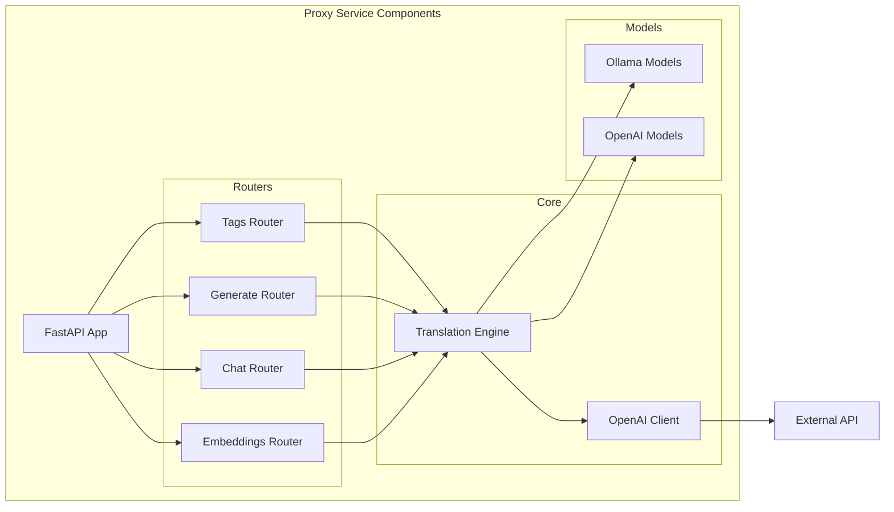

# Components

## FastAPI Application

**Responsibility:** Main application entry point, route registration, middleware setup

**Key Interfaces:**

- GET /api/tags - List available models
- POST /api/generate - Generate text completion
- POST /api/chat - Chat conversation
- POST /api/embeddings - Generate embeddings

**Dependencies:** All routers, OpenAI client, configuration

**Technology Stack:** FastAPI 0.109.0, Uvicorn 0.27.0

## Translation Engine

**Responsibility:** Translate Ollama API requests into OpenAI SDK client calls

**Key Interfaces:**

- ollama_to_openai_generate() - Convert Ollama API request to OpenAI SDK parameters
- openai_to_ollama_generate() - Convert OpenAI SDK response to Ollama API format
- ollama_to_openai_chat() - Convert Ollama API request to OpenAI SDK parameters
- ollama_to_openai_embedding() - Convert Ollama API request to OpenAI SDK parameters

**Dependencies:** OpenAI SDK client, Pydantic models

**Technology Stack:** Python 3.12, OpenAI SDK 1.10.0, Pydantic 2.5.3

## OpenAI SDK Client

**Responsibility:** Manage communication with OpenAI-compatible backends

**Key Interfaces:**

- create_completion() - Create chat completions
- list_models() - List available models
- create_embeddings() - Generate embeddings

**Dependencies:** OpenAI Python SDK

**Technology Stack:** OpenAI Python SDK 1.10.0 with AsyncOpenAI client

## Component Diagrams

