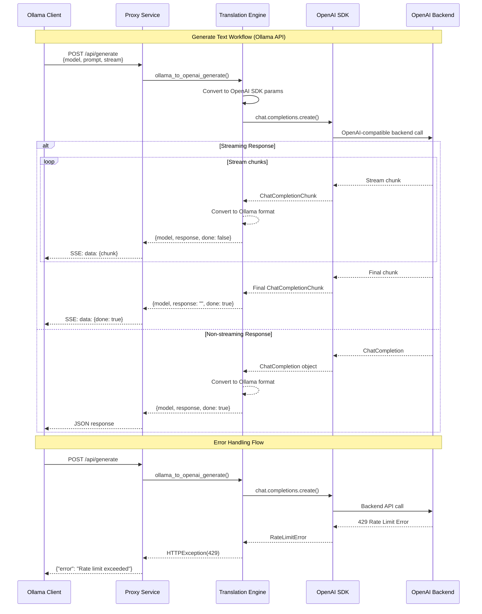

# Core Workflows

```mermaid
sequenceDiagram
    participant C as Ollama Client
    participant P as Proxy Service
    participant T as Translation Engine
    participant S as OpenAI SDK
    participant O as OpenAI Backend
    
    Note over C,O: Generate Text Workflow (Ollama API)
    
    C->>P: POST /api/generate<br/>{model, prompt, stream}
    P->>T: ollama_to_openai_generate()
    T->>T: Convert to OpenAI SDK params
    T->>S: chat.completions.create()
    S->>O: OpenAI-compatible backend call
    
    alt Streaming Response
        loop Stream chunks
            O-->>S: Stream chunk
            S-->>T: ChatCompletionChunk
            T-->>T: Convert to Ollama format
            T-->>P: {model, response, done: false}
            P-->>C: SSE: data: {chunk}
        end
        O-->>S: Final chunk
        S-->>T: Final ChatCompletionChunk
        T-->>P: {model, response: "", done: true}
        P-->>C: SSE: data: {done: true}
    else Non-streaming Response
        O-->>S: ChatCompletion
        S-->>T: ChatCompletion object
        T-->>T: Convert to Ollama format
        T-->>P: {model, response, done: true}
        P-->>C: JSON response
    end
    
    Note over C,O: Error Handling Flow
    
    C->>P: POST /api/generate
    P->>T: ollama_to_openai_generate()
    T->>S: chat.completions.create()
    S->>O: Backend API call
    O-->>S: 429 Rate Limit Error
    S-->>T: RateLimitError
    T-->>P: HTTPException(429)
    P-->>C: {"error": "Rate limit exceeded"}
```
