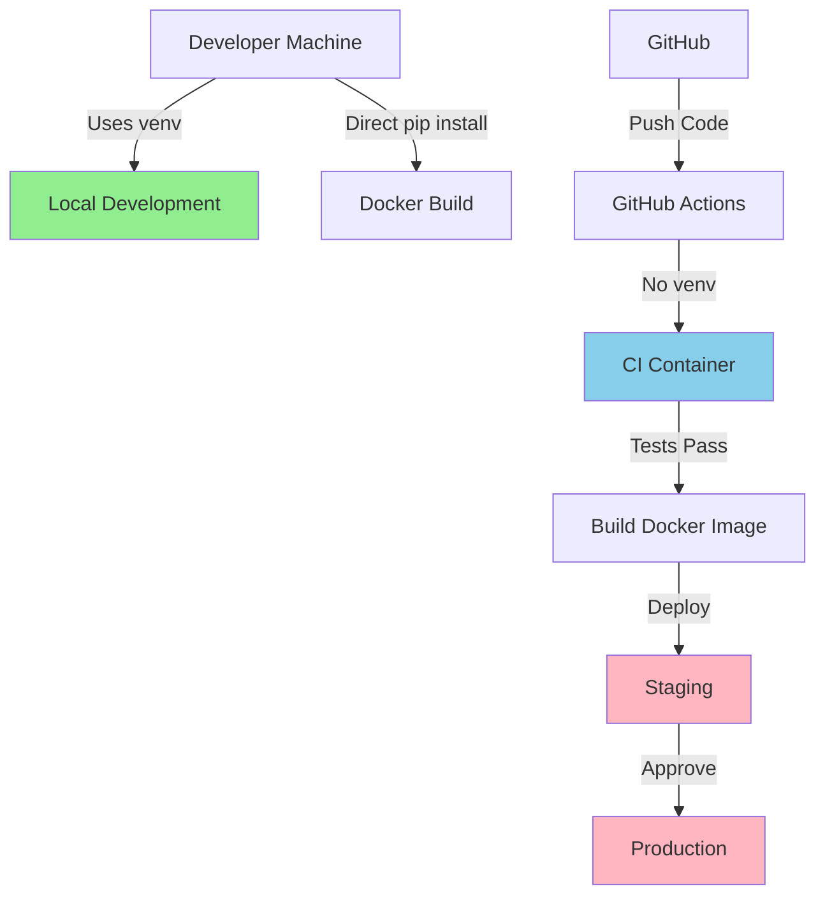

# Development Environment Setup

## Overview

The Ollama-OpenAI Proxy project uses different environment strategies for different contexts:

| Environment | Virtual Environment (venv) | Rationale |
|-------------|---------------------------|-----------|
| Local Development | ✅ Required | Isolation from system Python, reproducible environments |
| CI/CD (GitHub Actions) | ❌ Not Used | Fresh containers provide isolation |
| Docker Containers | ❌ Not Used | Container isolation is sufficient |
| Production | ❌ Not Used | Runs in Docker containers |

## Local Development Setup

### Prerequisites

- Python 3.12 or higher
- Git
- Docker Desktop (optional, for container testing)

### Initial Setup

1. **Clone the repository:**
   ```bash
   git clone <repository-url>
   cd ollama-openai-proxy
   ```

2. **Create virtual environment:**
   ```bash
   python -m venv venv
   ```

3. **Activate virtual environment:**
   
   **Linux/macOS:**
   ```bash
   source venv/bin/activate
   ```
   
   **Windows:**
   ```bash
   venv\Scripts\activate
   ```

4. **Install dependencies:**
   ```bash
   pip install -r requirements-dev.txt
   ```

5. **Install pre-commit hooks:**
   ```bash
   pre-commit install
   ```

### Daily Development Workflow

1. **Always activate venv before working:**
   ```bash
   source venv/bin/activate  # Linux/macOS
   # or
   venv\Scripts\activate     # Windows
   ```

2. **Verify you're in venv:**
   ```bash
   which python
   # Should show: /path/to/project/venv/bin/python
   ```

3. **Run the application:**
   ```bash
   python -m ollama_openai_proxy
   ```

4. **Run tests:**
   ```bash
   pytest
   ```

5. **Run linting:**
   ```bash
   ruff check .
   ```

6. **Run type checking:**
   ```bash
   mypy .
   ```

### Environment Variables

Create a `.env` file for local development:

```bash
# .env
OPENAI_API_KEY=your-api-key-here
OPENAI_API_BASE_URL=https://api.openai.com/v1
PROXY_PORT=11434
LOG_LEVEL=INFO
```

## CI/CD Environment

### GitHub Actions Configuration

CI/CD runs in isolated containers without virtual environments:

```yaml
name: CI Pipeline
on: [push, pull_request]

jobs:
  test:
    runs-on: ubuntu-latest
    steps:
      - uses: actions/checkout@v4
      
      - name: Set up Python
        uses: actions/setup-python@v4
        with:
          python-version: '3.12'
      
      - name: Install dependencies
        run: |
          pip install -r requirements-dev.txt
      
      - name: Run tests
        run: |
          pytest
      
      - name: Run linting
        run: |
          ruff check .
      
      - name: Run type checking
        run: |
          mypy .
```

### Why No venv in CI/CD?

- Each job runs in a fresh container
- Complete isolation between runs
- Faster execution (no venv creation overhead)
- Simpler configuration

## Docker Development

### Local Docker Testing

For testing in a Docker environment similar to production:

```bash
# Build the image
docker build -t ollama-openai-proxy .

# Run with environment variables
docker run -p 11434:11434 \
  -e OPENAI_API_KEY=$OPENAI_API_KEY \
  ollama-openai-proxy
```

### Docker Compose Development

```yaml
# docker-compose.yml
version: '3.8'
services:
  proxy:
    build: .
    ports:
      - "11434:11434"
    environment:
      - OPENAI_API_KEY=${OPENAI_API_KEY}
    volumes:
      - ./src:/app/src  # Hot reload for development
```

## Best Practices

### Do's

- ✅ Always use venv for local development
- ✅ Keep venv activated while working
- ✅ Run tests before committing
- ✅ Use pre-commit hooks
- ✅ Keep dependencies in requirements files updated

### Don'ts

- ❌ Never install packages globally
- ❌ Don't commit venv directory
- ❌ Don't use venv in CI/CD or Docker
- ❌ Don't mix system Python with project Python

## Troubleshooting

### Common Issues

1. **"Module not found" errors:**
   - Ensure venv is activated
   - Reinstall dependencies: `pip install -r requirements-dev.txt`

2. **Wrong Python version:**
   - Check: `python --version`
   - Create new venv with correct Python: `python3.12 -m venv venv`

3. **Pre-commit hooks failing:**
   - Ensure you're in venv when running `pre-commit install`
   - Update hooks: `pre-commit autoupdate`

4. **Docker build fails:**
   - Docker doesn't use venv - check Dockerfile
   - Ensure requirements.txt is up to date

## Environment Configuration Summary



This architecture ensures:
- Consistent local development environments
- Fast CI/CD execution
- Lightweight production containers
- Clear separation of concerns