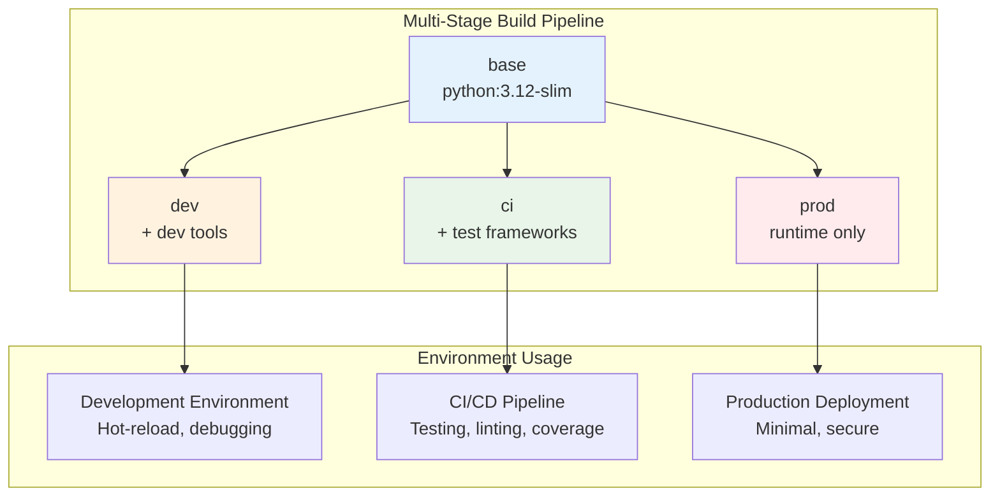

# Docker Architecture

## Overview

This document outlines the comprehensive Docker architecture for the Ollama-OpenAI Proxy Service, implementing a multi-stage build strategy optimized for development, CI/CD, and production environments. The architecture supports the transition from virtual environment-based development to a Docker-first approach while maintaining development productivity and production security.

## Multi-Stage Docker Strategy

### Architecture Philosophy

The Docker architecture follows a **single Dockerfile, multi-stage approach** to optimize for different use cases while maintaining consistency across environments. Each stage builds upon the previous, creating specialized containers for specific purposes.



### Stage Definitions

#### Stage 1: Base (`base`)
**Purpose:** Common foundation for all environments
```dockerfile
FROM python:3.12-slim as base

# Security updates and essential tools
RUN apt-get update && apt-get install -y \
    --no-install-recommends \
    curl \
    ca-certificates \
    && rm -rf /var/lib/apt/lists/*

# Create non-root user
RUN useradd -m -u 1000 appuser && \
    mkdir -p /app && \
    chown -R appuser:appuser /app

WORKDIR /app
USER appuser

# Common Python setup
COPY requirements.txt .
RUN pip install --no-cache-dir --user -r requirements.txt
```

**Characteristics:**
- Security-hardened base with minimal packages
- Non-root user setup (appuser:1000)
- Core dependencies installation
- Common directory structure

#### Stage 2: Development (`dev`)
**Purpose:** Development environment with tools and hot-reload
```dockerfile
FROM base as dev

# Switch to root for development tool installation
USER root

# Development dependencies
RUN pip install --no-cache-dir \
    debugpy \
    ipython \
    jupyter \
    watchdog

# Development-specific configurations
COPY docker/dev-entrypoint.sh /usr/local/bin/
RUN chmod +x /usr/local/bin/dev-entrypoint.sh

USER appuser

# Hot-reload friendly command
CMD ["dev-entrypoint.sh"]
```

**Characteristics:**
- Development tools (debugger, REPL, notebook)
- Hot-reload capabilities via volume mounts
- Development-friendly logging and debugging
- Prepared for future dev containers integration

#### Stage 3: CI (`ci`)
**Purpose:** CI/CD testing and quality assurance
```dockerfile
FROM base as ci

# Testing dependencies
COPY requirements-dev.txt .
RUN pip install --no-cache-dir --user -r requirements-dev.txt

# Copy source code for testing
COPY --chown=appuser:appuser src/ ./src/
COPY --chown=appuser:appuser tests/ ./tests/
COPY --chown=appuser:appuser pyproject.toml pytest.ini ./

# Default test command
CMD ["pytest", "--cov=src", "--cov-report=xml", "--cov-report=term"]
```

**Characteristics:**
- Complete test framework (pytest, coverage, linting)
- Source code included for testing
- Optimized for automated CI/CD execution
- Coverage reporting and quality gates

#### Stage 4: Production (`prod`)
**Purpose:** Minimal production runtime
```dockerfile
FROM base as prod

# Copy only application source
COPY --chown=appuser:appuser src/ ./src/

# Health check configuration
HEALTHCHECK --interval=30s --timeout=10s --start-period=5s --retries=3 \
    CMD python -c "import urllib.request; urllib.request.urlopen('http://localhost:11434/health')"

# Production startup
EXPOSE 11434
CMD ["python", "-m", "ollama_openai_proxy.main"]
```

**Characteristics:**
- Minimal attack surface (runtime dependencies only)
- Built-in health checks for orchestration
- Optimized startup and resource usage
- Security-hardened configuration

## Container Registry Strategy

### GitHub Container Registry Integration

**Registry Configuration:**
- **Primary Registry:** `ghcr.io/[username]/ollama-openai-proxy`
- **Authentication:** GitHub token-based (GITHUB_TOKEN)
- **Visibility:** Public (open source project)
- **Features:** Vulnerability scanning, multi-arch support

**Image Tagging Strategy:**
```text
Tagging Convention:
├── latest                    # Latest stable release
├── v{major}.{minor}.{patch}  # Semantic versioning
├── sha-{commit}              # Commit-specific builds
├── dev                       # Development builds
└── pr-{number}               # Pull request builds
```

### Image Publishing Workflow

```yaml
# GitHub Actions GHCR Publishing
- name: Login to GitHub Container Registry
  uses: docker/login-action@v2
  with:
    registry: ghcr.io
    username: ${{ github.actor }}
    password: ${{ secrets.GITHUB_TOKEN }}

- name: Build and push multi-stage images
  run: |
    # Build all stages
    docker build --target prod -t ghcr.io/${{ github.repository }}:latest .
    docker build --target prod -t ghcr.io/${{ github.repository }}:${{ github.sha }} .
    
    # Push images
    docker push ghcr.io/${{ github.repository }}:latest
    docker push ghcr.io/${{ github.repository }}:${{ github.sha }}
```

## Environment-Specific Configurations

### Development Environment

**Docker Compose Configuration (`docker/docker-compose.dev.yml`):**
```yaml
version: '3.8'

services:
  ollama-proxy-dev:
    build:
      context: ..
      dockerfile: docker/Dockerfile
      target: dev
    ports:
      - "11434:11434"
    volumes:
      - ../src:/app/src:rw
      - ../tests:/app/tests:rw
    environment:
      - ENV=development
      - LOG_LEVEL=DEBUG
      - OPENAI_API_KEY=${OPENAI_API_KEY}
    command: python -m ollama_openai_proxy.main --reload
```

**Development Workflow:**
```bash
# Start development environment
docker-compose -f docker/docker-compose.dev.yml up

# Run tests in dev container
docker-compose -f docker/docker-compose.dev.yml exec ollama-proxy-dev pytest

# Interactive debugging
docker-compose -f docker/docker-compose.dev.yml exec ollama-proxy-dev python -m debugpy
```

### CI/CD Environment

**GitHub Actions Integration:**
```yaml
name: Docker Build and Test

on:
  push:
    branches: [master, main]
  pull_request:
    branches: [master, main]

jobs:
  docker-ci:
    runs-on: ubuntu-latest
    steps:
      - uses: actions/checkout@v4
      
      - name: Build CI image
        run: docker build --target ci -t ollama-proxy:ci .
      
      - name: Run tests in container
        run: |
          docker run --rm \
            -e OPENAI_API_KEY=${{ secrets.OPENAI_API_KEY }} \
            -e LOG_LEVEL=DEBUG \
            ollama-proxy:ci
      
      - name: Run linting in container  
        run: |
          docker run --rm ollama-proxy:ci ruff check src/ tests/
      
      - name: Run type checking in container
        run: |
          docker run --rm ollama-proxy:ci mypy src/
```

### Production Environment

**Production Docker Compose (`docker/docker-compose.prod.yml`):**
```yaml
version: '3.8'

services:
  ollama-proxy:
    image: ghcr.io/[username]/ollama-openai-proxy:latest
    container_name: ollama-openai-proxy
    restart: unless-stopped
    ports:
      - "11434:11434"
    environment:
      - ENV=production
      - LOG_LEVEL=${LOG_LEVEL:-INFO}
      - OPENAI_API_KEY=${OPENAI_API_KEY}
      - OPENAI_API_BASE_URL=${OPENAI_API_BASE_URL:-https://api.openai.com/v1}
    volumes:
      - ./logs:/app/logs:rw
      - /etc/localtime:/etc/localtime:ro
    healthcheck:
      test: ["CMD", "python", "-c", "import urllib.request; urllib.request.urlopen('http://localhost:11434/health')"]
      interval: 30s
      timeout: 10s
      retries: 3
      start_period: 40s
    networks:
      - proxy-network
    deploy:
      resources:
        limits:
          memory: 256M
          cpus: '0.5'
        reservations:
          memory: 128M
          cpus: '0.1'

networks:
  proxy-network:
    driver: bridge
    ipam:
      driver: default
      config:
        - subnet: 172.20.0.0/16
```

## Security Architecture

### Container Security Model

**Security Layers:**
1. **Base Image Security:** Regular python:3.12-slim updates
2. **User Security:** Non-root execution (appuser:1000)
3. **Filesystem Security:** Read-only root filesystem where possible
4. **Network Security:** Minimal port exposure, isolated networks
5. **Resource Security:** Memory and CPU limits in production

**Security Hardening:**
```dockerfile
# Security hardening in base stage
RUN apt-get update && apt-get install -y \
    --no-install-recommends \
    curl \
    ca-certificates \
    && apt-get clean \
    && rm -rf /var/lib/apt/lists/* \
    && rm -rf /tmp/* \
    && rm -rf /var/tmp/*

# File permissions
RUN chown -R appuser:appuser /app && \
    chmod -R 755 /app

# Remove shell access in production
RUN rm -rf /bin/sh /bin/bash || true
```

### Registry Security

**GitHub Container Registry Security:**
- **Vulnerability Scanning:** Automatic scanning on push
- **Access Control:** Repository-based permissions
- **Audit Logging:** Complete image push/pull audit trail
- **Image Signing:** Docker Content Trust support

## Performance Optimization

### Build Performance

**Layer Caching Strategy:**
```dockerfile
# Optimized layer order for caching
1. Base system packages (changes rarely)
2. Python dependencies (changes occasionally)
3. Application source code (changes frequently)
```

**Build Optimization Techniques:**
- **Multi-stage builds:** Reduce final image size by 60%+
- **Layer caching:** Faster builds through GitHub Actions cache
- **Dependency optimization:** Separate requirements files for different stages
- **Build context:** .dockerignore excludes unnecessary files

### Runtime Performance

**Container Resource Optimization:**
```yaml
# Production resource limits
resources:
  limits:
    memory: 256M      # Maximum memory usage
    cpus: '0.5'       # Maximum CPU usage
  reservations:
    memory: 128M      # Reserved memory
    cpus: '0.1'       # Reserved CPU
```

**Performance Metrics:**
- **Image Size:** Production ~200MB (vs ~500MB without multi-stage)
- **Startup Time:** <5 seconds average
- **Memory Usage:** ~50MB baseline
- **Response Time:** <100ms proxy overhead maintained

## Monitoring and Observability

### Container Health Monitoring

**Health Check Implementation:**
```python
# Enhanced health check endpoint
@app.get("/health")
async def health_check():
    return {
        "status": "healthy",
        "version": __version__,
        "timestamp": datetime.utcnow().isoformat(),
        "environment": os.getenv("ENV", "production"),
        "container_id": os.getenv("HOSTNAME", "unknown")
    }
```

**Docker Health Check Configuration:**
```dockerfile
HEALTHCHECK --interval=30s --timeout=10s --start-period=5s --retries=3 \
    CMD python -c "import urllib.request; urllib.request.urlopen('http://localhost:11434/health')"
```

### Logging Strategy

**Container Logging:**
- **Format:** Structured JSON logs to stdout/stderr
- **Rotation:** Docker log rotation policies
- **Aggregation:** Compatible with log aggregation systems
- **Levels:** Environment-specific log levels

```python
# Container-optimized logging configuration
logging.config.dictConfig({
    "version": 1,
    "disable_existing_loggers": False,
    "formatters": {
        "json": {
            "format": '{"timestamp": "%(asctime)s", "level": "%(levelname)s", "logger": "%(name)s", "message": "%(message)s", "container_id": "' + os.getenv("HOSTNAME", "unknown") + '"}'
        }
    },
    "handlers": {
        "console": {
            "class": "logging.StreamHandler",
            "formatter": "json",
            "stream": "ext://sys.stdout"
        }
    },
    "root": {
        "level": os.getenv("LOG_LEVEL", "INFO"),
        "handlers": ["console"]
    }
})
```

## Deployment Architecture

### Production Deployment Process

**Deployment Workflow:**
```bash
# Production deployment steps
1. Image Pull:     docker pull ghcr.io/[username]/ollama-openai-proxy:latest
2. Config Update:  cp .env.prod .env
3. Service Deploy: docker-compose -f docker/docker-compose.prod.yml up -d
4. Health Check:   docker-compose exec ollama-proxy curl http://localhost:11434/health
5. Log Monitor:    docker-compose logs -f ollama-proxy
```

**Zero-Downtime Deployment:**
```bash
# Rolling update process
1. Pull new image
2. Start new container with different name
3. Health check new container
4. Update load balancer/proxy
5. Stop old container
6. Cleanup old image
```

### Rollback Strategy

**Container Rollback Process:**
```bash
# Emergency rollback procedure
1. Identify last known good version:
   docker image ls ghcr.io/[username]/ollama-openai-proxy

2. Update docker-compose with specific tag:
   image: ghcr.io/[username]/ollama-openai-proxy:v1.0.0

3. Redeploy service:
   docker-compose -f docker/docker-compose.prod.yml up -d

4. Verify service health:
   curl http://localhost:11434/health

5. Monitor metrics and logs:
   docker-compose logs -f ollama-proxy
```

**Rollback Triggers:**
- Failed health checks (3+ consecutive failures)
- Error rate > 5% over 5 minutes
- Memory usage > 90% for 2+ minutes
- Manual trigger via monitoring alert

## Future Architecture Evolution

### Kubernetes Migration Readiness

**Container Architecture Benefits for K8s:**
- **12-Factor App Compliance:** Stateless, configurable via environment
- **Health Checks:** Ready for K8s probes (readiness, liveness)
- **Resource Limits:** Prepared for K8s resource management
- **Service Discovery:** Compatible with K8s networking

**Kubernetes Manifest Example:**
```yaml
apiVersion: apps/v1
kind: Deployment
metadata:
  name: ollama-openai-proxy
spec:
  replicas: 3
  selector:
    matchLabels:
      app: ollama-openai-proxy
  template:
    metadata:
      labels:
        app: ollama-openai-proxy
    spec:
      containers:
      - name: proxy
        image: ghcr.io/[username]/ollama-openai-proxy:latest
        ports:
        - containerPort: 11434
        env:
        - name: OPENAI_API_KEY
          valueFrom:
            secretKeyRef:
              name: openai-secret
              key: api-key
        resources:
          limits:
            memory: "256Mi"
            cpu: "500m"
          requests:
            memory: "128Mi"
            cpu: "100m"
        livenessProbe:
          httpGet:
            path: /health
            port: 11434
          initialDelaySeconds: 30
          periodSeconds: 30
        readinessProbe:
          httpGet:
            path: /health
            port: 11434
          initialDelaySeconds: 5
          periodSeconds: 5
```

### Dev Containers Integration (Future Epic)

**Development Container Configuration:**
```json
// .devcontainer/devcontainer.json
{
  "name": "Ollama OpenAI Proxy Dev",
  "dockerFile": "../docker/Dockerfile",
  "build": {
    "target": "dev"
  },
  "mounts": [
    "source=${localWorkspaceFolder}/src,target=/app/src,type=bind,consistency=cached"
  ],
  "forwardPorts": [11434],
  "postCreateCommand": "pip install -e .",
  "extensions": [
    "ms-python.python",
    "ms-python.black-formatter",
    "charliermarsh.ruff"
  ]
}
```

This Docker architecture provides a solid foundation for current needs while being prepared for future enhancements like Kubernetes orchestration and development container integration.