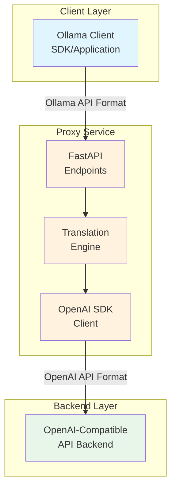

# High Level Architecture

## Technical Summary

The Ollama-OpenAI Proxy Service is a stateless, lightweight translation layer built with FastAPI that implements the Ollama API specification. The service's core purpose is to maintain 100% compatibility with the Ollama SDK and API, allowing existing Ollama applications to use OpenAI-compatible models without code changes. It uses the OpenAI Python SDK as a client library to communicate with backends, while exposing the Ollama API format to clients. The architecture follows KISS principles with no complex state management, enabling horizontal scalability and straightforward deployment.

## High Level Overview

1. **Architectural Style**: Stateless Microservice with API Gateway pattern
2. **Repository Structure**: Monorepo containing all proxy service code
3. **Service Architecture**: Single service acting as a translation layer
4. **Primary Data Flow**: Ollama Client → HTTP → Proxy Service → HTTP → OpenAI Backend
5. **Key Architectural Decisions**:
   - Use official OpenAI SDK for reliability and compatibility
   - Stateless design for horizontal scalability
   - Minimal dependencies to reduce complexity
   - Direct format translation without business logic

## High Level Project Diagram

## Architectural and Design Patterns

- **API Gateway Pattern:** Proxy acts as a single entry point for Ollama clients - *Rationale:* Provides clean abstraction and format translation
- **Adapter Pattern:** Translators convert Ollama API requests to OpenAI SDK calls - *Rationale:* Maintains Ollama API compatibility while using OpenAI SDK as client
- **Stateless Service Pattern:** No session or request history storage - *Rationale:* Simplifies scaling and deployment
- **Repository Pattern:** Not used - direct SDK calls preferred - *Rationale:* OpenAI SDK provides sufficient abstraction
- **Streaming Pattern:** Server-Sent Events for real-time responses - *Rationale:* Matches both Ollama and OpenAI streaming expectations
