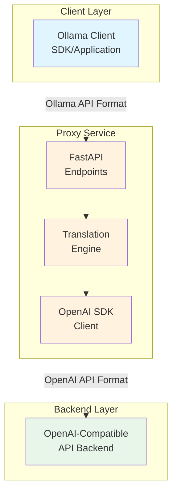
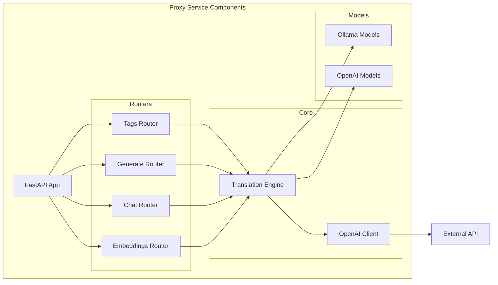
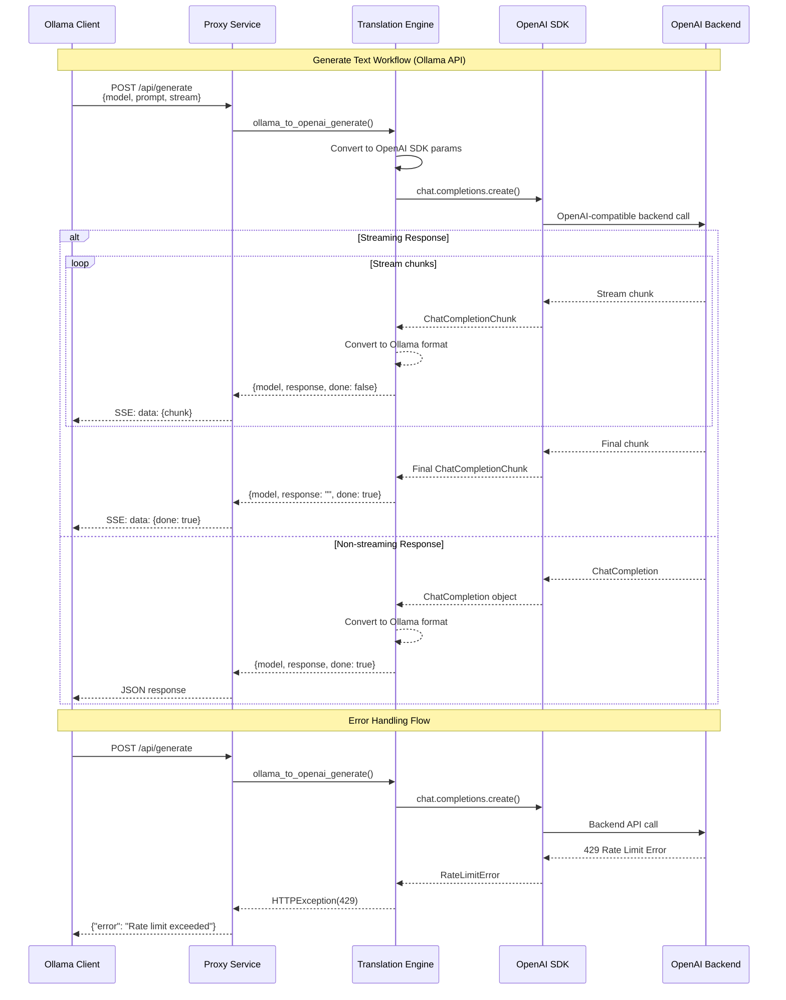

# Ollama-OpenAI Proxy Service Architecture Document

## Introduction

This document outlines the overall project architecture for Ollama-OpenAI Proxy Service, including backend systems, shared services, and non-UI specific concerns. Its primary goal is to serve as the guiding architectural blueprint for AI-driven development, ensuring consistency and adherence to chosen patterns and technologies.

**Primary Technical Goal:** Create a proxy service that implements the Ollama API specification, allowing the official Ollama SDK to seamlessly communicate with OpenAI-compatible backends without any client-side code changes. Success is measured by complete Ollama SDK compatibility. The service exposes Ollama API endpoints and uses the OpenAI SDK as a client library to communicate with backends.

**Relationship to Frontend Architecture:**
If the project includes a significant user interface, a separate Frontend Architecture Document will detail the frontend-specific design and MUST be used in conjunction with this document. Core technology stack choices documented herein (see "Tech Stack") are definitive for the entire project, including any frontend components.

### Starter Template or Existing Project

N/A - This project is built from scratch without using a starter template. The architecture is custom-designed specifically for the proxy service requirements.

### Change Log

| Date | Version | Description | Author |
|------|---------|-------------|--------|
| 2024-12-05 | 1.0 | Initial architecture document | Project Team |
| 2025-01-23 | 2.0 | Converted to BMad architecture template format | BMad Master |

## High Level Architecture

### Technical Summary

The Ollama-OpenAI Proxy Service is a stateless, lightweight translation layer built with FastAPI that implements the Ollama API specification. The service's core purpose is to maintain 100% compatibility with the Ollama SDK and API, allowing existing Ollama applications to use OpenAI-compatible models without code changes. It uses the OpenAI Python SDK as a client library to communicate with backends, while exposing the Ollama API format to clients. The architecture follows KISS principles with no complex state management, enabling horizontal scalability and straightforward deployment.

### High Level Overview

1. **Architectural Style**: Stateless Microservice with API Gateway pattern
2. **Repository Structure**: Monorepo containing all proxy service code
3. **Service Architecture**: Single service acting as a translation layer
4. **Primary Data Flow**: Ollama Client → HTTP → Proxy Service → HTTP → OpenAI Backend
5. **Key Architectural Decisions**:
   - Use official OpenAI SDK for reliability and compatibility
   - Stateless design for horizontal scalability
   - Minimal dependencies to reduce complexity
   - Direct format translation without business logic

### High Level Project Diagram



### Architectural and Design Patterns

- **API Gateway Pattern:** Proxy acts as a single entry point for Ollama clients - *Rationale:* Provides clean abstraction and format translation
- **Adapter Pattern:** Translators convert Ollama API requests to OpenAI SDK calls - *Rationale:* Maintains Ollama API compatibility while using OpenAI SDK as client
- **Stateless Service Pattern:** No session or request history storage - *Rationale:* Simplifies scaling and deployment
- **Repository Pattern:** Not used - direct SDK calls preferred - *Rationale:* OpenAI SDK provides sufficient abstraction
- **Streaming Pattern:** Server-Sent Events for real-time responses - *Rationale:* Matches both Ollama and OpenAI streaming expectations

## Tech Stack

### Cloud Infrastructure

- **Provider:** Any cloud provider or on-premises
- **Key Services:** Container runtime (Docker), Orchestration (Kubernetes optional)
- **Deployment Regions:** Configurable based on requirements

### Technology Stack Table

| Category | Technology | Version | Purpose | Rationale |
|----------|------------|---------|---------|-----------|
| **Language** | Python | 3.12 | Primary development language | Latest stable version, improved performance, better error messages |
| **Runtime** | Python | 3.12 | Application runtime | Enhanced async performance, per-interpreter GIL |
| **Framework** | FastAPI | 0.109.0 | Web framework | Native async, automatic OpenAPI docs, Pydantic integration |
| **HTTP Server** | Uvicorn | 0.27.0 | ASGI server | High performance, production-ready |
| **SDK** | OpenAI Python | 1.10.0 | OpenAI API client | Official SDK with built-in retry, streaming, error handling |
| **Validation** | Pydantic | 2.5.3 | Data validation | Type safety, automatic validation |
| **Container** | Docker | 24.0 | Containerization | Standard deployment format |
| **Orchestration** | Docker Compose | 2.23 | Multi-container apps | Local development and testing |
| **Packaging** | setuptools | 69.0 | Python packaging | Build wheels for distribution |
| **Package Dist** | twine | 4.0.2 | PyPI upload | Secure package uploads to PyPI |
| **Build Tool** | build | 1.0.3 | PEP 517 builder | Modern Python package building |
| **Testing** | pytest | 7.4.4 | Test framework | Powerful, extensive plugin ecosystem |
| **Testing** | pytest-asyncio | 0.23.3 | Async test support | Required for async endpoint testing |
| **Linting** | ruff | 0.1.14 | Code linting | Fast, comprehensive Python linter |
| **Type Checking** | mypy | 1.8.0 | Static type checking | Catches type errors early |

## Data Models

### OllamaGenerateRequest

**Purpose:** Represents an Ollama API text generation request

**Key Attributes:**

- model: str - The model identifier to use
- prompt: str - The text prompt to generate from
- stream: bool - Whether to stream the response
- options: Dict[str, Any] - Additional generation parameters

**Relationships:**

- Translated to OpenAI ChatCompletionRequest
- Response mapped to OllamaGenerateResponse

### OllamaGenerateResponse

**Purpose:** Represents an Ollama API generation response

**Key Attributes:**

- model: str - The model that generated the response
- created_at: str - ISO timestamp of generation
- response: str - The generated text
- done: bool - Whether generation is complete

**Relationships:**

- Created from OpenAI ChatCompletionResponse
- Streamed as JSON chunks for streaming requests

### OllamaChatRequest

**Purpose:** Represents an Ollama API chat conversation request

**Key Attributes:**

- model: str - The model identifier to use
- messages: List[Dict[str, str]] - Conversation history
- stream: bool - Whether to stream the response
- options: Dict[str, Any] - Additional chat parameters

**Relationships:**

- Direct mapping to OpenAI ChatCompletionRequest
- Response mapped to OllamaChatResponse

### OllamaEmbeddingRequest

**Purpose:** Represents an Ollama API embedding generation request

**Key Attributes:**

- model: str - The embedding model to use
- prompt: str - The text to embed

**Relationships:**

- Translated to OpenAI EmbeddingRequest
- Response mapped to OllamaEmbeddingResponse

## Components

### FastAPI Application

**Responsibility:** Main application entry point, route registration, middleware setup

**Key Interfaces:**

- GET /api/tags - List available models
- POST /api/generate - Generate text completion
- POST /api/chat - Chat conversation
- POST /api/embeddings - Generate embeddings

**Dependencies:** All routers, OpenAI client, configuration

**Technology Stack:** FastAPI 0.109.0, Uvicorn 0.27.0

### Translation Engine

**Responsibility:** Translate Ollama API requests into OpenAI SDK client calls

**Key Interfaces:**

- ollama_to_openai_generate() - Convert Ollama API request to OpenAI SDK parameters
- openai_to_ollama_generate() - Convert OpenAI SDK response to Ollama API format
- ollama_to_openai_chat() - Convert Ollama API request to OpenAI SDK parameters
- ollama_to_openai_embedding() - Convert Ollama API request to OpenAI SDK parameters

**Dependencies:** OpenAI SDK client, Pydantic models

**Technology Stack:** Python 3.12, OpenAI SDK 1.10.0, Pydantic 2.5.3

### OpenAI SDK Client

**Responsibility:** Manage communication with OpenAI-compatible backends

**Key Interfaces:**

- create_completion() - Create chat completions
- list_models() - List available models
- create_embeddings() - Generate embeddings

**Dependencies:** OpenAI Python SDK

**Technology Stack:** OpenAI Python SDK 1.10.0 with AsyncOpenAI client

### Component Diagrams



## Backend Integration

### OpenAI-Compatible Backend Services

- **Purpose:** Backend services that the proxy communicates with
- **Communication Method:** OpenAI Python SDK (used as client library only)
- **Base URL(s):** Configurable via OPENAI_API_BASE_URL environment variable
- **Authentication:** Bearer token via API key
- **Rate Limits:** Depends on backend provider

**OpenAI SDK Client Usage:**

- `client.models.list()` - Called when Ollama client requests /api/tags
- `client.chat.completions.create()` - Called for /api/generate and /api/chat
- `client.embeddings.create()` - Called for /api/embeddings

**Important Architecture Note:** 
The OpenAI SDK is used purely as a client library to communicate with OpenAI-compatible backends. This service implements the Ollama API specification, NOT the OpenAI API. The translation happens between Ollama API format (what we expose) and OpenAI SDK method calls (how we communicate with backends).

## API Endpoints & Development Phases

### Development Phase 1: Foundation

#### GET /api/tags

- **Purpose**: List available models (Ollama API endpoint)
- **Ollama SDK Method**: `client.list()`
- **Implementation**: Use OpenAI SDK's `client.models.list()` to fetch models
- **Priority**: MUST be implemented first to establish basic connectivity
- **Testing**: Verify Ollama SDK can list models through proxy

```text
Request Flow:
Ollama Client → GET /api/tags → Proxy → GET /v1/models → OpenAI
                                  ↓
                            Transform Response
                                  ↓
Ollama Client ← Ollama Format ← Proxy ← Model List ← OpenAI
```

### Development Phase 2: Core Generation

#### POST /api/generate

- **Purpose**: Generate text completion (Ollama API endpoint)
- **Ollama SDK Method**: `client.generate()`
- **Implementation**: Use OpenAI SDK's `client.chat.completions.create()`
- **Priority**: Second implementation priority
- **Key Features**: Must support both streaming and non-streaming modes
- **Testing**: Verify both streaming and non-streaming generation

### Development Phase 3: Advanced Features

#### POST /api/chat

- **Purpose**: Chat conversation with message history (Ollama API endpoint)
- **Ollama SDK Method**: `client.chat()`
- **Implementation**: Use OpenAI SDK's `client.chat.completions.create()` with messages
- **Note**: Similar to generate but with conversation context
- **Testing**: Multi-turn conversations through SDK

#### POST /api/embeddings, /api/embed

- **Purpose**: Generate text embeddings (Ollama API endpoints)
- **Ollama SDK Method**: `client.embeddings()`
- **Implementation**: Use OpenAI SDK's `client.embeddings.create()`
- **Note**: Two endpoint aliases for same functionality
- **Testing**: Verify embedding generation and format

## Core Workflows



## Ollama API Implementation

This service implements the Ollama API specification to maintain compatibility with Ollama clients. The OpenAI SDK is used solely as a client library to communicate with OpenAI-compatible backends.

### Ollama API Endpoints

#### GET /api/tags
```json
// Ollama Request
GET /api/tags

// Ollama Response
{
  "models": [
    {
      "name": "llama2:latest",
      "modified_at": "2023-08-04T19:56:02.647Z",
      "size": 3826793677
    }
  ]
}
```

#### POST /api/generate
```json
// Ollama Request
{
  "model": "llama2",
  "prompt": "Why is the sky blue?",
  "stream": false,
  "options": {
    "temperature": 0.7
  }
}

// Ollama Response (non-streaming)
{
  "model": "llama2",
  "created_at": "2023-08-04T19:56:02.647Z",
  "response": "The sky is blue because...",
  "done": true,
  "total_duration": 5589157167,
  "load_duration": 3013701500
}

// Ollama Response (streaming)
{"model":"llama2","created_at":"2023-08-04T19:56:02.647Z","response":"The","done":false}
{"model":"llama2","created_at":"2023-08-04T19:56:02.647Z","response":" sky","done":false}
{"model":"llama2","created_at":"2023-08-04T19:56:02.647Z","response":"","done":true}
```

#### POST /api/chat
```json
// Ollama Request
{
  "model": "llama2",
  "messages": [
    {"role": "user", "content": "Hello!"}
  ],
  "stream": false
}

// Ollama Response
{
  "model": "llama2",
  "created_at": "2023-08-04T19:56:02.647Z",
  "message": {
    "role": "assistant",
    "content": "Hello! How can I help you today?"
  },
  "done": true
}
```

#### POST /api/embeddings or /api/embed
```json
// Ollama Request
{
  "model": "llama2",
  "prompt": "Here is some text to embed"
}

// Ollama Response
{
  "embedding": [0.1, 0.2, 0.3, ...]
}
```

## Database Schema

N/A - This service is stateless and does not use a database. All data is transient within request/response cycles.

## Source Tree

```plaintext
ollama-openai-proxy/
├── src/
│   ├── __init__.py
│   ├── main.py                    # FastAPI application entry
│   ├── config.py                  # Configuration management
│   ├── models/
│   │   ├── __init__.py
│   │   ├── ollama.py             # Ollama request/response models
│   │   └── openai.py             # OpenAI model mappings
│   ├── routers/
│   │   ├── __init__.py
│   │   ├── tags.py               # GET /api/tags endpoint
│   │   ├── generate.py           # POST /api/generate endpoint
│   │   ├── chat.py               # POST /api/chat endpoint
│   │   └── embeddings.py         # POST /api/embeddings endpoint
│   ├── services/
│   │   ├── __init__.py
│   │   ├── translator.py         # Core translation logic
│   │   └── openai_client.py      # OpenAI SDK wrapper
│   └── utils/
│       ├── __init__.py
│       ├── errors.py             # Error handling utilities
│       └── streaming.py          # SSE streaming helpers
├── tests/
│   ├── __init__.py
│   ├── conftest.py               # pytest configuration
│   ├── unit/
│   │   ├── test_models.py
│   │   ├── test_translator.py
│   │   └── test_routers.py
│   └── integration/
│       ├── test_ollama_sdk.py
│       ├── test_streaming.py
│       └── test_error_handling.py
├── docker/
│   ├── Dockerfile
│   └── docker-compose.yml
├── scripts/
│   ├── start.sh                  # Development start script
│   ├── test.sh                   # Test runner script
│   ├── build.sh                  # Build wheel package
│   └── publish.sh                # Publish to PyPI
├── requirements.txt              # Production dependencies
├── requirements-dev.txt          # Development dependencies
├── pyproject.toml               # Project configuration (PEP 517)
├── setup.py                      # Package setup (for compatibility)
├── setup.cfg                     # Setup configuration
├── MANIFEST.in                   # Package manifest
├── .env.example                 # Environment variables template
├── LICENSE                       # License file
└── README.md                    # Project documentation
```

## Infrastructure and Deployment

### Infrastructure as Code

- **Tool:** Docker 24.0, Docker Compose 2.23
- **Location:** `docker/`
- **Approach:** Containerized deployment with environment-based configuration

### Deployment Strategy

- **Strategy:** Multiple deployment options - Docker, Docker Compose, Python wheel, PyPI
- **CI/CD Platform:** GitHub Actions (or configurable)
- **Pipeline Configuration:** `.github/workflows/deploy.yml`

### Deployment Options

#### 1. Docker Deployment
- Build Docker image with multi-stage build for optimization
- Push to container registry (Docker Hub, GitHub Container Registry, etc.)
- Deploy single container or orchestrated with Kubernetes

#### 2. Docker Compose Deployment
- Local development with hot-reload
- Multi-service deployment with dependencies
- Environment-specific compose files (dev, prod)

#### 3. Python Wheel Distribution
- Build universal wheel for distribution
- Include all dependencies in requirements
- Support for offline installation

#### 4. PyPI Distribution
- Publish as `ollama-openai-proxy` package
- Semantic versioning (major.minor.patch)
- Installation via `pip install ollama-openai-proxy`
- CLI entry point for direct execution

### Environments

- **Development:** Local Docker container with hot-reload enabled - http://localhost:11434
- **Staging:** Containerized deployment with production-like config - Validate before production
- **Production:** Highly available deployment with monitoring - Load balanced, multi-instance

### Environment Promotion Flow

```text
Development -> Staging -> Production

1. Local development with docker-compose
2. Build and test in CI
3. Deploy to staging environment
4. Run integration tests
5. Manual approval gate
6. Deploy to production
7. Smoke tests and monitoring
```

### Rollback Strategy

- **Primary Method:** Container image rollback via orchestrator
- **Trigger Conditions:** Failed health checks, error rate > 10%, manual trigger
- **Recovery Time Objective:** < 5 minutes

### Package Distribution

```toml
# pyproject.toml excerpt
[build-system]
requires = ["setuptools>=69.0", "wheel"]
build-backend = "setuptools.build_meta"

[project]
name = "ollama-openai-proxy"
version = "1.0.0"
description = "Proxy service to translate between Ollama and OpenAI APIs"
requires-python = ">=3.12"

[project.scripts]
ollama-openai-proxy = "ollama_openai_proxy.main:run"
```

## Error Handling Strategy

### General Approach

- **Error Model:** Exception-based with typed errors from OpenAI SDK
- **Exception Hierarchy:** OpenAI SDK exceptions → HTTP exceptions → Client errors
- **Error Propagation:** Catch at service boundary, translate to HTTP status codes

### Logging Standards

- **Library:** Python logging module
- **Format:** JSON structured logging
- **Levels:** DEBUG, INFO, WARNING, ERROR, CRITICAL
- **Required Context:**
  - Correlation ID: UUID per request
  - Service Context: endpoint, method, model
  - User Context: No PII, only request metadata

### Error Handling Patterns

#### External API Errors

- **Retry Policy:** Built into OpenAI SDK with exponential backoff
- **Circuit Breaker:** Not implemented - rely on SDK retry logic
- **Timeout Configuration:** 60s default, 300s for streaming
- **Error Translation:** SDK exceptions to HTTP status codes

#### Business Logic Errors

- **Custom Exceptions:** ValidationError, TranslationError
- **User-Facing Errors:** {"error": {"message": "...", "type": "...", "code": "..."}}
- **Error Codes:** Standard HTTP status codes

#### Data Consistency

- **Transaction Strategy:** N/A - stateless service
- **Compensation Logic:** N/A - no state changes
- **Idempotency:** All operations naturally idempotent

## Coding Standards

### Core Standards

- **Languages & Runtimes:** Python 3.12
- **Style & Linting:** ruff with default configuration
- **Test Organization:** tests/{unit,integration}/test_*.py

### Naming Conventions

| Element | Convention | Example |
|---------|------------|---------|
| Functions | snake_case | translate_request |
| Classes | PascalCase | OllamaGenerateRequest |
| Constants | UPPER_SNAKE_CASE | DEFAULT_TIMEOUT |
| Modules | snake_case | openai_client.py |

### Critical Rules

- **Async All The Way:** All route handlers and service methods must be async
- **Type Everything:** All functions must have type hints for parameters and returns
- **No Direct OpenAI Calls:** Always use the OpenAI SDK wrapper service
- **Error Context:** All errors must include request context for debugging
- **No Hardcoded URLs:** All external URLs must come from configuration
- **Python 3.12 Features:** Use new features like improved error messages and f-string debugging

## Test Strategy and Standards

### Testing Philosophy

- **Primary Goal:** Verify complete Ollama SDK compatibility with proxy service
- **Approach:** SDK-driven testing - use official Ollama SDK as test client
- **Coverage Goals:** 100% Ollama SDK method coverage, 80% code coverage
- **Test Pyramid:** 60% unit, 30% integration (SDK compatibility), 10% E2E
- **Success Criteria:** Existing Ollama code works unchanged when pointed at proxy

### Test Types and Organization

#### Unit Tests

- **Framework:** pytest 7.4.3
- **File Convention:** test_{module_name}.py
- **Location:** tests/unit/
- **Mocking Library:** pytest-mock, unittest.mock
- **Coverage Requirement:** 90% for core modules

**AI Agent Requirements:**
- Generate tests for all public methods
- Cover edge cases and error conditions
- Follow AAA pattern (Arrange, Act, Assert)
- Mock all external dependencies

#### Integration Tests

- **Scope:** Ollama SDK compatibility testing with all proxy endpoints
- **Location:** tests/integration/
- **Primary Focus:** Verify official Ollama Python SDK works seamlessly with proxy
- **Test Infrastructure:**
  - **Ollama SDK:** Use official SDK as test client
  - **OpenAI Backend:** Mock responses using pytest fixtures
  - **Streaming:** Test SSE responses with SDK streaming methods
  - **Compatibility Matrix:** Test all SDK methods against proxy

**SDK Compatibility Test Suite:**
```python
# Example test structure
import ollama

async def test_ollama_sdk_list():
    client = ollama.Client(host='http://localhost:11434')
    models = await client.list()
    # Verify response matches Ollama format
    
async def test_ollama_sdk_generate():
    client = ollama.Client(host='http://localhost:11434')
    response = await client.generate(
        model='llama2',
        prompt='Hello world'
    )
    # Verify streaming and non-streaming
    
async def test_ollama_sdk_chat():
    client = ollama.Client(host='http://localhost:11434')
    response = await client.chat(
        model='llama2',
        messages=[{'role': 'user', 'content': 'Hello'}]
    )
    
async def test_ollama_sdk_embeddings():
    client = ollama.Client(host='http://localhost:11434')
    response = await client.embeddings(
        model='llama2',
        prompt='Hello world'
    )
```

#### End-to-End Tests

- **Framework:** pytest with official Ollama Python SDK
- **Scope:** Complete Ollama SDK workflow testing against proxy
- **Environment:** Docker compose with proxy and mock OpenAI backend
- **Test Scenarios:**
  - List models with `client.list()`
  - Generate text with `client.generate()` (streaming and non-streaming)
  - Chat conversations with `client.chat()`
  - Create embeddings with `client.embeddings()`
  - Error handling for all SDK methods
  - Performance comparison with direct Ollama server

### Test Data Management

- **Strategy:** Fixtures for all test data
- **Fixtures:** tests/fixtures/
- **Factories:** Not needed - simple data structures
- **Cleanup:** Automatic via pytest

### Continuous Testing

- **CI Integration:** Run on every PR, block merge on failure
- **SDK Compatibility Matrix:** Test against multiple Ollama SDK versions
- **Performance Tests:** Latency comparison between direct Ollama and proxy
- **Security Tests:** Dependency scanning with pip-audit
- **Regression Tests:** Ensure updates don't break SDK compatibility
- **Phased Testing:** Tests organized by development phase (tags → generate → chat/embed)

## Security

### Input Validation

- **Validation Library:** Pydantic 2.5.0
- **Validation Location:** Router level before processing
- **Required Rules:**
  - All external inputs MUST be validated
  - Validation at API boundary before processing
  - Whitelist approach preferred over blacklist

### Authentication & Authorization

- **Auth Method:** API key pass-through to backend
- **Session Management:** No sessions - stateless
- **Required Patterns:**
  - Never log API keys
  - Validate API key format if provided
  - Pass through Authorization header unchanged

### Secrets Management

- **Development:** .env file (git-ignored)
- **Production:** Environment variables from orchestrator
- **Code Requirements:**
  - NEVER hardcode secrets
  - Access via configuration service only
  - No secrets in logs or error messages

### API Security

- **Rate Limiting:** Delegated to backend API
- **CORS Policy:** Configurable, disabled by default
- **Security Headers:** X-Content-Type-Options, X-Frame-Options
- **HTTPS Enforcement:** TLS termination at ingress

### Data Protection

- **Encryption at Rest:** N/A - no data storage
- **Encryption in Transit:** HTTPS for all external calls
- **PII Handling:** No PII storage or logging
- **Logging Restrictions:** No request/response bodies, no API keys

### Dependency Security

- **Scanning Tool:** pip-audit in CI
- **Update Policy:** Monthly security updates
- **Approval Process:** PR required for all dependency changes

### Security Testing

- **SAST Tool:** bandit for Python code
- **DAST Tool:** N/A - stateless API
- **Penetration Testing:** Annual for production deployments

## Checklist Results Report

*To be populated after architect-checklist execution*

## Next Steps

### For Implementation

**Phase 1: Foundation (Week 1)**
1. Set up development environment with Docker and Python 3.12
2. Implement `/api/tags` endpoint
3. Create Ollama SDK integration test for `client.list()`
4. Verify basic proxy functionality

**Phase 2: Core Generation (Week 2)**
5. Implement `/api/generate` endpoint
6. Add streaming support for SSE responses
7. Create comprehensive SDK tests for `client.generate()`
8. Test both streaming and non-streaming modes

**Phase 3: Advanced Features (Week 3)**
9. Implement `/api/chat` endpoint
10. Implement `/api/embeddings` and `/api/embed` endpoints
11. Complete SDK compatibility test suite
12. Performance optimization and testing

**Phase 4: Distribution (Week 4)**
13. Build wheel package for distribution
14. Create Docker and Docker Compose configurations
15. Documentation and examples
16. Optional: Publish to PyPI

### Development Prompts

Since this is a backend-only service with no UI components, proceed directly to implementation using the Dev agent with this architecture as reference.

**Dev Agent Prompt:**
Implement the Ollama-OpenAI proxy service following the phased approach in this architecture document. Use Python 3.12 and ensure the project can be deployed via Docker, Docker Compose, and as a Python wheel package.

**Critical Requirements:**
1. **Phase 1 First**: Start with `/api/tags` endpoint only
2. **Test with Ollama SDK**: Each endpoint must be tested with the official Ollama Python SDK
3. **Phased Development**: Complete and test each phase before moving to the next
4. **Primary Success Metric**: Existing Ollama SDK code works unchanged when pointed at proxy

**Implementation Order:**
- Phase 1: `/api/tags` - Verify `client.list()` works
- Phase 2: `/api/generate` - Verify `client.generate()` with streaming
- Phase 3: `/api/chat` and `/api/embeddings` - Complete SDK support

Each phase must include integration tests proving Ollama SDK compatibility before proceeding to the next phase.